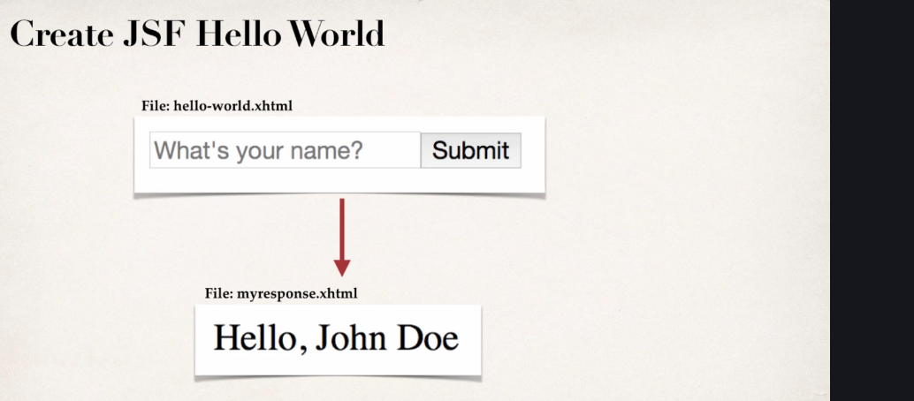

# [jsf-dev](https://gale.udemy.com/course/jsf-tutorial/learn/lecture/2617720#overview)
- JSF Dev using Tomcat 9, Java 8 Maven 3.8.8  
    - Step1: 
[Building Env for JSF using tomcat 9 and maven using vscode browser.](step1-jsf-with-dev-container.md)  
    - Step 2:
[Creating JSF Hello World Application](step2-scaffold-a-Hello-World-JSF-Application.md)

